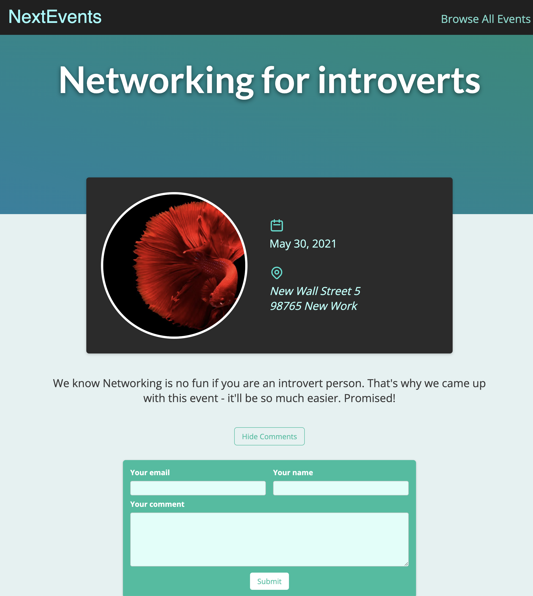

Built using NextJs. This is a simple event based project. Allowing user to add comments to event posts. This project allows me to wrap my head around and explore Server side rendering, server side props, static paths and static props and a few other NextJs features.

Using both firebase and mongodb. Can be changed to only using one or the other.

Course Project first dive into the world of NextJs

